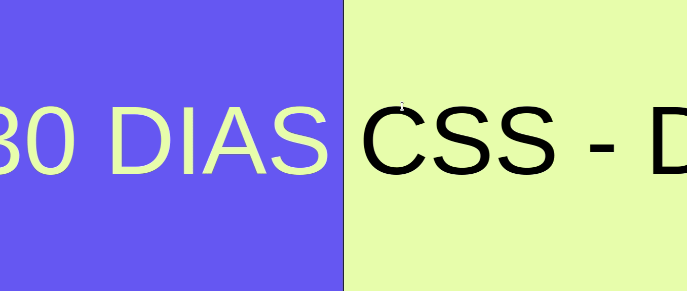

<h1 align="center">
  Desafio 03 - Mudança de cor de texto quando entra em outra div
</h1>

<h1>
  
</h1>

<h2> O que aprendi: 
<a href="https://www.w3schools.com/css/css_overflow.asp">overflow</a> 
<a href="https://www.w3schools.com/cssref/css3_pr_animation-keyframes.asp">animations</a>
